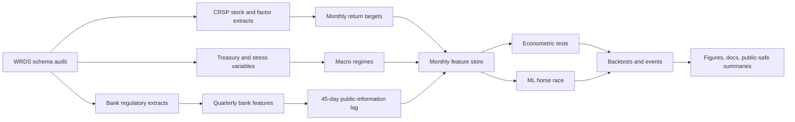

# Deposit Franchise and Duration Gap in U.S. Bank Equities

This repository implements a point-in-time research pipeline for testing whether
bank balance-sheet duration exposure and deposit-franchise fragility predict
U.S. bank equity returns.

> Do point-in-time bank balance-sheet duration exposure and deposit-franchise
> fragility define a priced, state-dependent source of expected return in U.S.
> bank equities?

The design is deliberately product-like: schema audit, restartable WRDS pulls,
public-information lagging, feature-store validation, econometric baselines,
walk-forward ML, implementation-aware backtests, event-time mechanism tests,
interpretability, and visual QA.

No API keys, WRDS credentials, raw licensed data, or real-data logs should be
committed.

## Current Full-Run Snapshot

The first scaled run used base WRDS Bank Regulatory access, not Bank Regulatory
Premium. Premium-only fields are handled through documented proxy variables.

| Item | Evidence |
|---|---:|
| Sample | 96,634 bank-months |
| Listed banks | 839 PERMNOs |
| Feature window | 2004-05 to 2025-11 |
| Public-information lag | 45 days |
| Static visual audit | 11 / 11 passed |
| Best mean rank IC | LightGBM, about 0.15 |
| Main duration-gap Fama-MacBeth t-stat | about -4.18 |
| Net strategy Sharpe after baseline costs | about 0.51 |

The full-run results are promising but still claim-disciplined: the
balance-sheet duration and high-stress fragility patterns are empirically
meaningful, the baseline post-cost long-short portfolio is positive, and the
factor-adjusted alpha is not yet strong enough to call this a finished
investable-alpha result.

## Workflow



## Quickstart

```bash
python -m pip install -e ".[all]"
ddgap smoke --out-dir artifacts/smoke
python scripts/summarize_artifacts.py --artifacts-dir artifacts/smoke --out data_manifest/smoke_public_summary.json
python scripts/build_report.py --summary data_manifest/smoke_public_summary.json --out artifacts/reports/paper.html
```

Component commands:

```bash
ddgap synthetic --out-dir artifacts/synthetic
ddgap features --raw-dir artifacts/synthetic/raw --out artifacts/synthetic/features.parquet
ddgap econometrics --features artifacts/synthetic/features.parquet --out-dir artifacts/synthetic/econometrics
ddgap events --features artifacts/synthetic/features.parquet --out-dir artifacts/synthetic/events
ddgap robustness --features artifacts/synthetic/features.parquet --out-dir artifacts/synthetic/robustness
ddgap lag-robustness --raw-dir artifacts/synthetic/raw --out-dir artifacts/synthetic/lag_robustness
ddgap train --features artifacts/synthetic/features.parquet --out-dir artifacts/synthetic/models
ddgap interpret --features artifacts/synthetic/features.parquet --out-dir artifacts/synthetic/interpretability
ddgap ipca --features artifacts/synthetic/features.parquet --out-dir artifacts/synthetic/ipca
ddgap backtest --predictions artifacts/synthetic/models/predictions.parquet --out-dir artifacts/synthetic/backtest
ddgap implementation-scenarios --predictions artifacts/synthetic/models/predictions.parquet --out-dir artifacts/synthetic/implementation_scenarios
ddgap factor-alpha --returns artifacts/synthetic/backtest/portfolio_returns.parquet --factors artifacts/synthetic/raw/factors_monthly.parquet --out-dir artifacts/synthetic/backtest
ddgap figures --features artifacts/synthetic/features.parquet --predictions artifacts/synthetic/models/predictions.parquet --backtest-dir artifacts/synthetic/backtest --out-dir artifacts/synthetic/figures --event-dir artifacts/synthetic/events --robustness-dir artifacts/synthetic/robustness
ddgap visual-audit --figures-dir artifacts/synthetic/figures/static --out-dir artifacts/synthetic/figures --contact-sheet artifacts/synthetic/figures/static_contact_sheet.png
```

When only downstream code changes after a successful WRDS pull, reuse cached raw
Parquet instead of querying WRDS:

```bash
ddgap full-live --out-dir artifacts/live_validation --skip-extract --first-test-year 2022 --last-test-year 2023
```

## Proposal Coverage

Implemented proposal layers include:

- WRDS schema audit and schema-map freeze.
- Base Bank Regulatory, CRSP, Treasury/FRED fallback, CBOE VIX, and Fama-French
  factor extraction.
- RSSD-to-listed-bank linking through WRDS bank-CRSP links and parent-child
  aggregation.
- Quarterly-to-monthly 45-day public-information lag engine.
- Duration, deposit-fragility, capital, loan-book, market, macro, and interaction
  feature blocks.
- Fama-MacBeth regressions, portfolio sorts, March 2023 event study, local
  projections, state dependence, placebo tests, lag-variant robustness, and
  subperiod tests.
- Elastic Net, LightGBM, and FT-Transformer walk-forward models.
- SHAP, permutation importance, family-level importance, partial dependence,
  scenario explorer, and PCA/IPCA-style factor interpretation layer.
- Beta-neutral monthly long-short backtest, transaction costs, holding buffer,
  name caps, equal/value/risk-scaled implementation scenarios, factor alpha, and
  turnover diagnostics.
- Static PNG/PDF/SVG figure pack, interactive HTML outputs, automated visual
  audit, and contact-sheet review.
- CI, docs build, report scaffold, citation metadata, license, SQL templates,
  environment file, and public-safe manifest summaries.
- Evidence-bound claim ledger and closeout audit in `docs/claim_ledger.md`.

## Amarel Guardrails

Use only:

`/scratch/nt612/Github/Deposit Franchise and Duration Gap in Bank Equity Asset Pricing/`

Run heavy jobs on compute allocations, not login nodes. WRDS pulls are cached,
manifested, and designed to stop rather than retry aggressively if WRDS
authentication or MFA blocks access.
