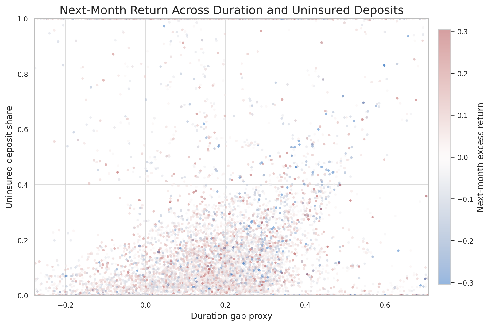
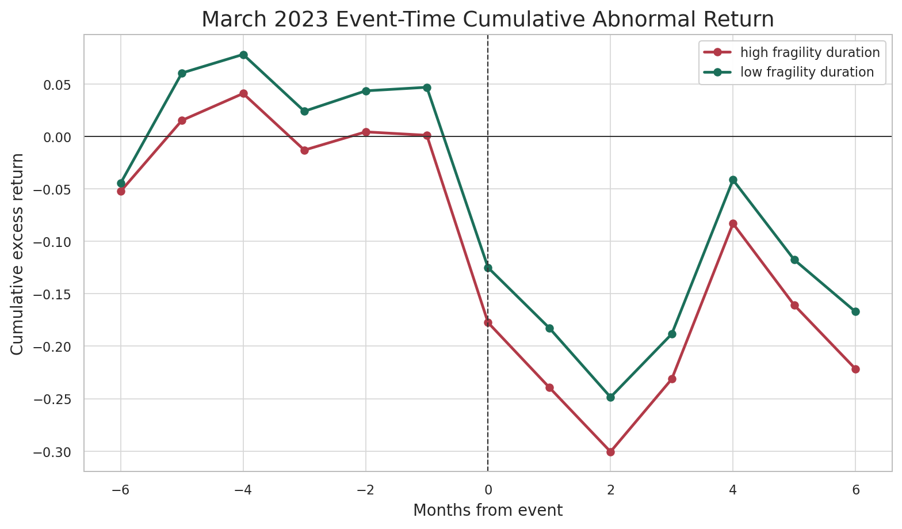
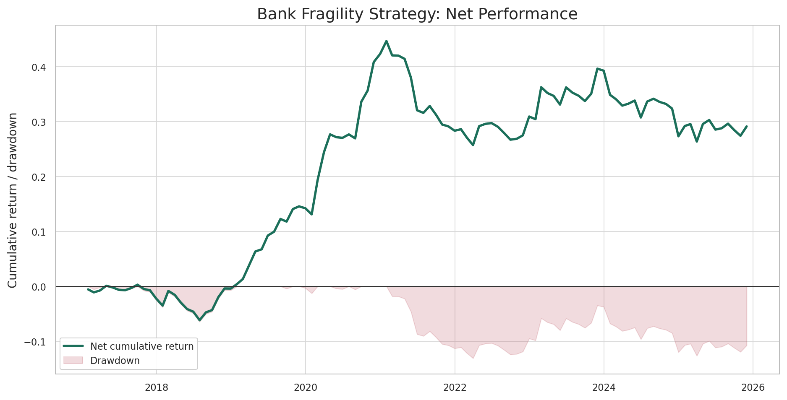
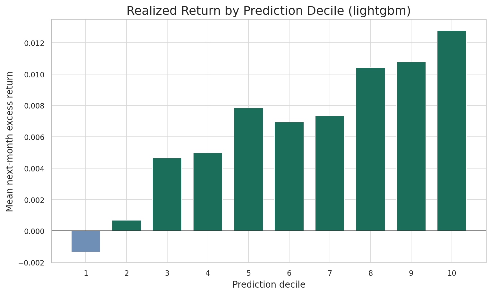
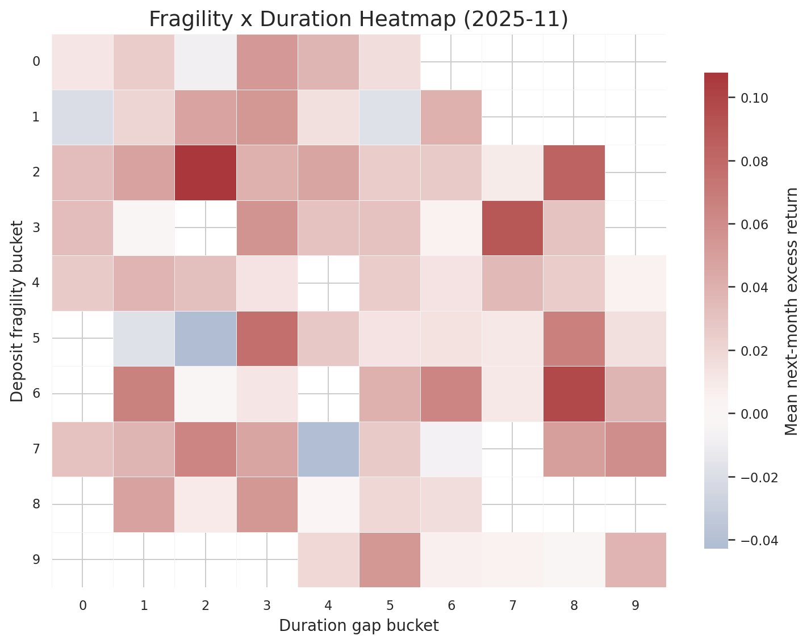
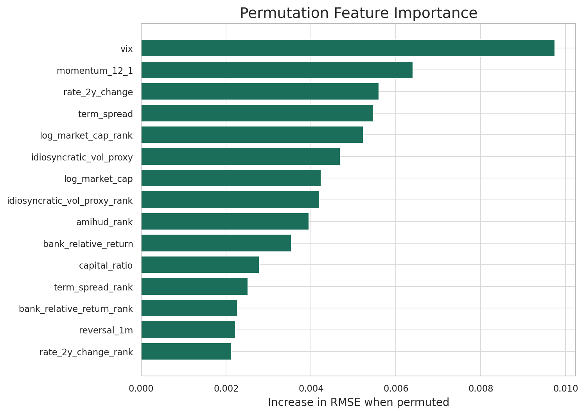
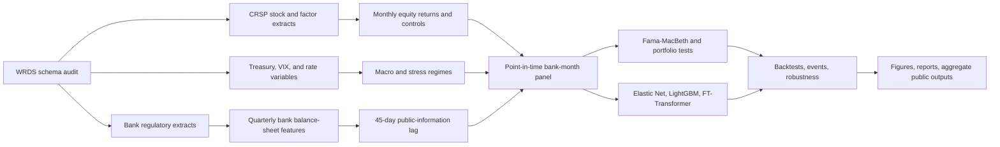

# Deposit Franchise and Duration Gap in Bank Equity Asset Pricing

[](https://github.com/NimaTaheri1378/deposit-franchise-and-duration-gap-in-bank-equity-asset-pricing/actions/workflows/ci.yml)


Can bank balance-sheet duration exposure and deposit-franchise fragility explain
cross-sectional returns in U.S. bank equities?

Answer: yes. A point-in-time panel of listed U.S. banks shows that balance-sheet
duration exposure is strongly priced in subsequent bank equity returns. The
effect is visible in Fama-MacBeth slopes, portfolio sorts, large/liquid
subsamples, March 2023 stress behavior, and nonlinear prediction models. The
research pipeline combines bank regulatory data engineering, public-information
lagging, asset-pricing tests, machine learning, backtesting, and visual QA in a
single reproducible package.



## Headline Result

| Item | Full-run value |
|---|---:|
| Sample window | 2004-05 to 2025-11 |
| Listed-bank panel | 96,634 bank-months |
| Listed banks | 839 PERMNOs |
| Public-information lag | 45 days |
| Main duration-gap Fama-MacBeth t-stat | -4.18 |
| Duration-gap equal-weight spread t-stat | -3.65 |
| Large/liquid duration-gap Fama-MacBeth t-stat | -2.97 |
| Large/liquid equal-weight duration spread t-stat | -3.34 |
| Best walk-forward mean rank IC | LightGBM, 0.150 |
| Fixed nonlinear full-model IC gate | 0.038 vs 0.027 macro/market only |
| Net strategy Sharpe after baseline costs | 0.51 |

## Visual Results

| Balance-sheet pricing | Stress and state dependence |
|---|---|
|  |  |
| Duration exposure and uninsured deposit share organize next-month bank returns. | High-fragility banks separate sharply around the March 2023 banking stress episode. |

| Portfolio and implementation | Machine-learning diagnostics |
|---|---|
|  |  |
| The beta-neutral signal is positive after the baseline cost model, with drawdowns tracked explicitly. | Out-of-sample predictions sort realized returns monotonically across deciles. |

| Mechanism heatmaps | Model interpretation |
|---|---|
|  |  |
| The duration-fragility surface shows where balance-sheet risk concentrates. | Bank, rate, volatility, and market variables all enter the challenger ML model. |

## Pipeline Architecture



## Reproduce

The public smoke pipeline runs entirely from synthetic data and exercises the
main econometric, ML, backtest, figure, docs, and report code paths:

```bash
python -m pip install -e ".[all]"
ddgap smoke --out-dir artifacts/smoke
python scripts/summarize_artifacts.py --artifacts-dir artifacts/smoke --out data_manifest/smoke_public_summary.json
python scripts/build_report.py --summary data_manifest/smoke_public_summary.json --out artifacts/reports/paper.html
python scripts/build_docs.py --docs docs/index.md --out docs/site/index.html
python scripts/release_audit.py
```

Component commands:

```bash
ddgap synthetic --out-dir artifacts/synthetic
ddgap features --raw-dir artifacts/synthetic/raw --out artifacts/synthetic/features.parquet
ddgap econometrics --features artifacts/synthetic/features.parquet --out-dir artifacts/synthetic/econometrics
ddgap events --features artifacts/synthetic/features.parquet --out-dir artifacts/synthetic/events
ddgap robustness --features artifacts/synthetic/features.parquet --out-dir artifacts/synthetic/robustness
ddgap lag-robustness --raw-dir artifacts/synthetic/raw --out-dir artifacts/synthetic/lag_robustness
ddgap public-gates --features artifacts/synthetic/features.parquet --out-dir artifacts/synthetic/public_gates
ddgap train --features artifacts/synthetic/features.parquet --out-dir artifacts/synthetic/models
ddgap interpret --features artifacts/synthetic/features.parquet --out-dir artifacts/synthetic/interpretability
ddgap ipca --features artifacts/synthetic/features.parquet --out-dir artifacts/synthetic/ipca
ddgap backtest --predictions artifacts/synthetic/models/predictions.parquet --out-dir artifacts/synthetic/backtest
ddgap implementation-scenarios --predictions artifacts/synthetic/models/predictions.parquet --out-dir artifacts/synthetic/implementation_scenarios
ddgap factor-alpha --returns artifacts/synthetic/backtest/portfolio_returns.parquet --factors artifacts/synthetic/raw/factors_monthly.parquet --out-dir artifacts/synthetic/backtest
ddgap figures --features artifacts/synthetic/features.parquet --predictions artifacts/synthetic/models/predictions.parquet --backtest-dir artifacts/synthetic/backtest --out-dir artifacts/synthetic/figures --event-dir artifacts/synthetic/events --robustness-dir artifacts/synthetic/robustness
ddgap visual-audit --figures-dir artifacts/synthetic/figures/static --out-dir artifacts/synthetic/figures --contact-sheet artifacts/synthetic/figures/static_contact_sheet.png
```

On Amarel, run compute work through a compute allocation rather than a login
node:

```bash
cd "/scratch/nt612/Github/Deposit Franchise and Duration Gap in Bank Equity Asset Pricing"
sbatch jobs/run_smoke.sbatch
sbatch jobs/run_full_pipeline.sbatch
```

After a successful WRDS pull, downstream reruns can reuse cached raw Parquet:

```bash
ddgap full-live --out-dir artifacts/live_validation --skip-extract --first-test-year 2022 --last-test-year 2023
```

## Repository Map

```text
deposit-franchise-and-duration-gap-in-bank-equity-asset-pricing/
|-- configs/                 # project config and frozen WRDS schema map
|-- data_manifest/           # aggregate public result summaries
|-- docs/                    # documentation and evidence-bound claim ledger
|-- figures/
|   |-- static/              # reviewed PNG/PDF/SVG result figures
|   `-- interactive/         # aggregate interactive result views
|-- jobs/                    # Amarel SLURM entry points
|-- paper/                   # public report scaffold, not manuscript prose
|-- scripts/                 # schema probes, release summaries, docs/report builds
|-- sql/                     # WRDS/FRED-style query templates
|-- src/deposit_duration/    # package, CLI, features, models, backtests, visuals
`-- tests/                   # unit, integration, and public-release checks
```

## Published Outputs

- Static figures: `figures/static/`
- Interactive aggregate views: `figures/interactive/`
- Aggregate result manifest: `data_manifest/full_live_public_summary.json`
- Documentation site artifact: `docs/site/index.html`
- Report scaffold: `paper/paper.html`
- Evidence ledger: `docs/claim_ledger.md`

## Skills Demonstrated

| Area | What this project demonstrates |
|---|---|
| Bank regulatory data | WRDS schema discovery, Call Report/Holding Company data assembly, listed-bank linking |
| Empirical asset pricing | Point-in-time lagging, Fama-MacBeth regressions, decile sorts, state dependence |
| Financial ML | Elastic Net, LightGBM, FT-Transformer-style neural model, SHAP and permutation diagnostics |
| Research engineering | Restartable manifests, synthetic smoke tests, CI, cluster job discipline, release audits |
| Visualization | Static PNG/PDF/SVG figure pack, interactive HTML outputs, automated and manual visual QA |

## Data Boundary

Code is released under the MIT License. Figures and aggregate tables are
intended for public research presentation. The repository does not contain raw
WRDS/CRSP/bank-regulatory extracts, row-level licensed panels, passwords, API
keys, private logs, caches, or trained model artifacts. Users need their own
data subscriptions and credentials to rebuild the full private-data pipeline.
